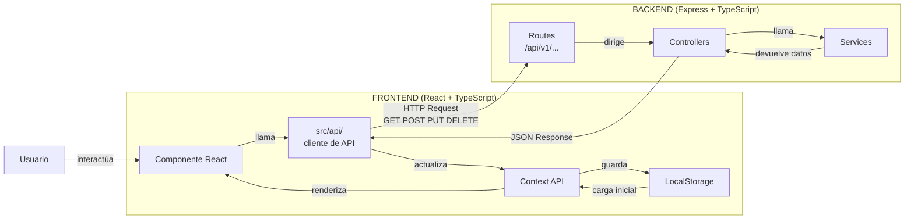

# Arquitectura de la Aplicación

---

## 1. Estructura de componentes principales

La aplicación tiene tres páginas principales:

- **HomePage**: Muestra el listado de todas las colonias
- **ColonyPage**: Muestra los gatos de una colonia concreta
- **CatPage**: Muestra la ficha completa de un gato

---

## 2. Componentes reutilizables

Estos componentes se usan en varias páginas:

- **Header**: Barra de navegación que aparece en todas las páginas
- **Button**: Botón estilizado reutilizable en toda la app
- **Badge**: Etiqueta pequeña para mostrar estados (esterilizado, enfermo, embarazada...)
- **Card**: Tarjeta genérica para mostrar colonias o gatos
- **Modal**: Ventana emergente para formularios (añadir gato, registrar desparasitación...)

---

## 3. Gestión del estado

Se usan dos niveles de estado:

- **Context API de React**: Para los datos globales que necesitan varias páginas (lista de colonias y gatos). Se combina con LocalStorage para que los datos no se pierdan al recargar la página.
- **useState**: Para cosas pequeñas que solo afectan a un componente, como si un modal está abierto o cerrado.

---

## 4. Diseño de la API REST

### Colonias

| Método | Endpoint | Descripción |
|--------|----------|-------------|
| GET | /api/v1/colonias | Devuelve la lista de todas las colonias |
| GET | /api/v1/colonias/:id | Devuelve una colonia concreta |
| POST | /api/v1/colonias | Crea una colonia nueva |
| PUT | /api/v1/colonias/:id | Actualiza una colonia existente |
| DELETE | /api/v1/colonias/:id | Elimina una colonia |

### Gatos

| Método | Endpoint | Descripción |
|--------|----------|-------------|
| GET | /api/v1/colonias/:id/gatos | Devuelve los gatos de una colonia |
| GET | /api/v1/gatos/:id | Devuelve un gato concreto |
| POST | /api/v1/colonias/:id/gatos | Crea un gato nuevo en una colonia |
| PUT | /api/v1/gatos/:id | Actualiza un gato existente |
| DELETE | /api/v1/gatos/:id | Elimina un gato |

### Contratos de datos

#### Colonia
```json
{
  "id": "1",
  "nombre": "Colonia del Parque",
  "direccion": "Calle Mayor 1",
  "cuidador": "Isabel",
  "coordenadas": {
    "lat": 42.3359,
    "lng": -7.8639
  }
}
```

#### Gato
```json
{
  "id": "1",
  "coloniaId": "1",
  "nombre": "Manchas",
  "color": "negro y blanco",
  "sexo": "macho",
  "edad": 3,
  "esterilizado": true,
  "testado": false,
  "enfermo": false,
  "descripcionEnfermedad": "",
  "embarazada": false,
  "foto": "",
  "desparasitaciones": [
    {
      "fecha": "2024-01-15",
      "producto": "Stronghold"
    }
  ]
}
```

---

## 5. Persistencia de datos

### En el servidor (backend)
- Datos de las colonias
- Datos de los gatos
- Historial de desparasitaciones

### Solo en el cliente (LocalStorage)
- Preferencias del usuario
- Filtros seleccionados
- Datos cacheados para carga rápida

---

## 6. Diagrama del flujo de datos



---

## 7. Decisiones de arquitectura

- **Monorepo**: Frontend y backend en el mismo repositorio para simplificar el desarrollo
- **Context API sobre Redux**: La app no es suficientemente compleja para necesitar Redux
- **LocalStorage sobre base de datos**: Simplifica el desarrollo al no necesitar una base de datos externa
- **Arquitectura por capas en el backend**: Separa responsabilidades entre rutas, controladores y servicios, haciendo el código más mantenible
- **Cliente de API tipado**: Centralizar todas las llamadas al backend en `src/api/` hace que el código sea más limpio y fácil de mantener